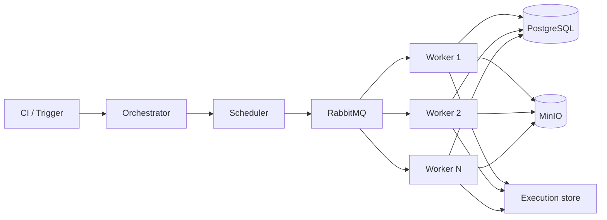

# Distributed Playwright Automation Platform POC

This repository implements a modular distributed Playwright execution platform designed to simulate the execution of 10,000 Playwright tests in parallel while preserving an architecture that can be replaced later with real browser test suites.

## Architecture overview

## Key design principles

- The queue is the boundary between scheduling and execution.
- Workers are stateless and consume jobs from RabbitMQ.
- Each test job is independent and can be retried without re-running the full suite.
- Browser contexts are isolated per test to avoid state leakage.
- Worker concurrency is configurable and intentionally limited.

## Project structure

- apps/orchestrator: submission and run tracking API
- apps/scheduler: dummy test model and job generation
- apps/worker: job execution with Playwright and retry handling
- apps/execution-store: live execution status plus MinIO-backed logs and screenshots
- packages/common: shared domain types
- packages/config: environment configuration
- packages/queue: RabbitMQ integration
- packages/database: PostgreSQL schema and initialization
- packages/storage: MinIO artifact helpers
- tests/dummy: dummy local browser app and generated fixtures
- infra/docker-compose.yml: local orchestration stack
- infra/kubernetes: Kubernetes manifests and design notes
- docker: Dockerfiles

## Requirements supported

- 10,000 dummy test cases generated on demand
- 60% short tests at 10s, 35% medium at 30s, 5% long at 60s
- deterministic failure rate and flaky failure rate via environment variables
- RabbitMQ queues: test.execution, test.retry, test.results, dead-letter queue
- PostgreSQL schema for runs/executions/attempts/workers
- MinIO for screenshots/videos/traces/logs
- Execution store UI for live status and completed artifacts
- Configurable worker replicas and per-worker concurrency
- Graceful shutdown support and retry semantics

## Local setup

1. Copy the environment file:

   cp .env.example .env

2. Install dependencies:

   npm install

3. Start the full local stack:

   docker compose -f infra/docker-compose.yml up --build

4. Trigger a run (this is what `npm run run:load` does — it posts to the orchestrator, it does not print metrics by itself):

   TEST_COUNT=100 npm run run:load

   Or:

   curl -X POST http://localhost:3000/runs -H 'Content-Type: application/json' -d '{"testCount":100,"targetDurationMinutes":120,"browser":"chromium"}'

5. Open live results:

   - Execution store: http://localhost:3100
   - MinIO console: http://localhost:9001 (minioadmin / minioadmin)

## Run examples

### 100 tests

TEST_COUNT=100 npm run run:load

### Wikipedia e2e (10 specs)

Local Playwright (no queue):

E2E_TARGET=local npm run run:e2e

Queue framework (orchestrator → RabbitMQ → workers → portal):

E2E_TARGET=queue npm run run:e2e

Then open http://localhost:3100

### 1,000 tests

TEST_COUNT=1000 WORKER_REPLICAS=10 WORKER_CONCURRENCY=4 npm run run:load

### 10,000 tests

TEST_COUNT=10000 WORKER_REPLICAS=50 WORKER_CONCURRENCY=4 npm run run:10k

## Demo scripts

- npm run generate-tests
- npm run start
- npm run run:10k
- npm run run:load
- npm run worker
- npm run orchestrator
- npm run test:dummy

## Throughput and ETA model

The orchestration service tracks total tests, completed tests, and active jobs. Throughput is calculated as completed tests per minute, and ETA is estimated as remaining tests divided by throughput.

For example:

- 10,000 total
- 7,200 completed
- 2,800 remaining
- 95 tests/minute
- ETA ≈ 29.5 minutes

## Concurrency model

The POC deliberately avoids creating one process or browser per test. Instead, a worker pool controls concurrency:

- worker replicas: configurable
- concurrency per worker: configurable
- global concurrency: configurable through MAX_CONCURRENT_TESTS

Example:

- 10 workers × 4 concurrency = 40 concurrent test executions
- 50 workers × 4 concurrency = 200 concurrent test executions

This scales horizontally without changing the test model.

## RabbitMQ and retry architecture

The queue model is:

- test.execution for initial work
- test.retry for retry scheduling
- test.results for completed outcomes
- dead-letter queue for recovery

When a test fails, the worker publishes a retry job and does not permanently lose the work. Retry attempts are tracked separately and can later be surfaced in the database.

## Worker failure recovery

Optional simulation is available through SIMULATE_WORKER_FAILURE=true. This is intended to demonstrate recovery behavior by intentionally terminating a worker during execution. The job remains in the queue or is reprocessed by RabbitMQ/DLX semantics.

## Artifact storage

MinIO stores screenshots, traces, videos, and logs using a directory pattern such as:

RUN_ID/TEST_ID/ATTEMPT_1/screenshot.png

Failed tests keep richer artifacts, while successful ones can be trimmed according to retention policies.

## Live results

The execution store at http://localhost:3100 shows per-test status, duration, logs, and screenshots. Completed logs and screenshots are stored in MinIO. RabbitMQ management at http://localhost:15672 shows queue depth if you need operational signal.

## Kubernetes architecture

The repository includes a Kubernetes design under infra/kubernetes for:

- namespace
- orchestrator deployment
- worker deployment
- RabbitMQ
- PostgreSQL
- MinIO
- ConfigMaps and Secrets
- Services
- HPA/KEDA-oriented queue-based scaling

This is designed to support later deployment, but the POC remains local-first via Docker Compose.

## Important operational note

The architecture uses isolated BrowserContexts per test to prevent shared cookies or localStorage from making the distributed run non-deterministic. This matters at 10,000-test scale because shared state becomes a bottleneck and a source of false failures.

## Future evolution

This POC intentionally uses dummy tests, but the shape of the platform is compatible with real Playwright test suites. The worker executes jobs through the same queue model, so the main replacement is the test implementation rather than the orchestration platform itself.
